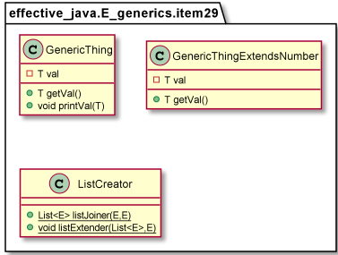
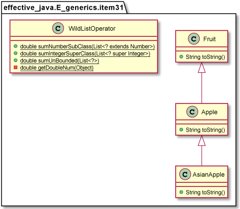

# Generics
* Item 26: Don’t use raw types
  
        Raw Type is If any generic class reference or instance is created 
        without mentioning the proper Type for the Generic type

* Item 27: Eliminate unchecked warnings
  
* Item 28: Prefer lists to arrays
  
      Lists checks type at compile time, arrays can fail at run time

* Item 29: Favor generic types

      
      Using generics allows type-safe abstraction without having to use typecasting which is much riskier in the long run.  

* Item 30: Favor generic methods
  
      public static <T> Set<T> union(Set<T> set1, Set<T> set2)
      raw type if not using <T>

* Item 31: Use bounded wildcards to increase API flexibility
  

    @Test
    public void testExtendFruit()
    {
        //List of apples
        List<Apple> apples = new ArrayList<>();
        apples.add(new Apple());

        //We can assign a list of apples to a basket of fruits, apple is subtype of fruit
        List<? extends Fruit> basket = apples;

        //Here we know that in basket there is nothing but fruit only
        for (Fruit fruit : basket)
        {
            System.out.println(fruit);
        }

        //basket.add(new Apple()); //Compile time error
        //basket.add(new Fruit()); //Compile time error
    }

    /***
     *  We are not able to add Fruit (super type of apple) to basket. Why?
     * Reason is that basket is a reference to a List of something that is a supertype of Apple.
     * Again, we cannot know which supertype it is, but we know that Apple and any of its subtypes
     * (which are subtype of Fruit) can be added to be without problem (you can always add a subtype
     * in collection of supertype). So, now we can add any type of Apple inside basket.
     *
     * In simple words, when you want to ONLY add elements inside a collection, treat it as a consumer
     * and use “? super T>” syntax. Now, “CONSUMER SUPER” also should make more sense to you.
     */

    @Test
    public void testSuperFruit()  {
        //List of apples
        List<Apple> apples = new ArrayList<Apple>();
        apples.add(new Apple());

        //We can assign a list of apples to a basket of apples, supertype of Apple
        List<? super Apple> basket = apples;

        //Here we know that in basket there is nothing but fruit only
        //for (Fruit fruit : basket)  //Compile time error, we cannot know which supertype it is
        {
        //    System.out.println(fruit);
        }

        basket.add(new Apple());    //Successful
        basket.add(new AsianApple()); //Successful
       // basket.add(new Fruit());    //Compile time error
    }

          //list members are sub class of Number
          public static double sumNumberSubClass(List<? extends Number> list)

          //list members are super class of Integer
          public static double sumIntegerSuperClass(List<? super Integer> list)

          //list members are any class
          public static double sumUnBounded(List<?> list)

          Use the <? extends T> wildcard if you need to retrieve object of type T from a collection.
          Use the <? super T> wildcard if you need to put objects of type T in a collection.
          If you need to satisfy both things, well, don’t use any wildcard. As simple as it is.
          In short, remember the term PECS. Producer extends Consumer super. Really easy to remember.

    @Test
    public void testSumNumberSubClass() {
        // Lists in this test are upper bounded to Number, list members are sub class of Number
        List<Integer> list1 = Arrays.asList(4, 5, 6, 7);
        List<Double> list2 = Arrays.asList(4.1, 5.1, 6.1);

        // printing
        System.out.println("Total sum is:" + WildListOperator.sumNumberSubClass(list1));
        System.out.print("Total sum is:" + WildListOperator.sumNumberSubClass(list2));

        //assertions
        Assert.assertEquals(SUM_LIST1,WildListOperator.sumNumberSubClass(list1),DELTA);
        Assert.assertEquals(SUM_LIST2,WildListOperator.sumNumberSubClass(list2),DELTA);

    }

    @Test
    public void testSumIntegerSuperClass() {
        // Lists in this test are lower bounded to Integer, list members are super class of Integer
        List<Integer> list1 = Arrays.asList(4, 5, 6, 7);
        List<Number> list2 = Arrays.asList(4.1, 5.1, 6.1);

        // printing
        System.out.println("Total sum is:" + WildListOperator.sumIntegerSuperClass(list1));
        System.out.println("Total sum is:" + WildListOperator.sumIntegerSuperClass(list2));

        //assertions
        Assert.assertEquals(SUM_LIST1,WildListOperator.sumIntegerSuperClass(list1),DELTA);
        Assert.assertEquals(SUM_LIST2,WildListOperator.sumIntegerSuperClass(list2),DELTA);
    }

* Item 32: Combine generics and varargs judiciously
  
* Item 33: Consider typesafe heterogeneous containers

        Enables multiple types in a data container 
        In summary, the normal use of generics, exemplified by the collections APIs, restricts you to a fixed 
        number of type parameters per container. You can get around this restriction by placing the type parameter 
        on the key rather than the container.

https://www.oreilly.com/library/view/effective-java/9780134686097/