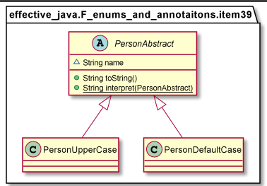

Item 34: Use enums instead of int constants
            
            Lower risk to enter something out of the domain, while entering data and also improves 
            the program readability. Additionally, enums in Java can have more information associated 
            with them, and can also have behaviour.

Item 35: Use instance fields instead of ordinals

            Lowers bug risk when reordering

Item 36: Use EnumSet instead of bit fields

Item 37: Use EnumMap instead of ordinal indexing

            Similar to HashMap but EnumMap requires the key type in the constructor.

    public class Plant {
    public enum LifeCycle {ANNUAL, PERENNIAL, BIENNIAL }

    final String name;
    final LifeCycle lifeCycle;

    public Plant(String name, LifeCycle lifecycle) {
        this.name = name;
        this.lifeCycle = lifecycle;
    }

    public LifeCycle getLifeCycle() {
        return lifeCycle;
    }

    @Override
    public String toString() {
        return name;
    }
    }

    @Test
    public void testPlant() {

        Map<Plant.LifeCycle, Set<Plant>> plantsByLifeCycle = new EnumMap<>(Plant.LifeCycle.class);
        List<Plant> garden=new ArrayList<>();
        garden.add(new Plant("Ek",Plant.LifeCycle.PERENNIAL));
        garden.add(new Plant("Ros",Plant.LifeCycle.ANNUAL));

        for (Plant.LifeCycle lc : Plant.LifeCycle.values()) {
            plantsByLifeCycle.put(lc, new HashSet<>());
        }

        for (Plant p : garden) {
            plantsByLifeCycle.get(p.getLifeCycle()).add(p);
        }
        System.out.println(plantsByLifeCycle);
    }

    =>

    {ANNUAL=[Ros], PERENNIAL=[Ek], BIENNIAL=[]}

Item 38: Emulate extensible enums with interfaces

Item 39: Prefer annotations to naming patterns

            if (p.getClass().isAnnotationPresent(OnlyUpperCase.class)) {

Item 40: Consistently use the Override annotation

Item 41: Use marker interfaces to define types

            Unlike annotations, interfaces allow us to take advantage of polymorphism. 
            As a result, we can add additional restrictions to the marker interface.

https://www.oreilly.com/library/view/effective-java/9780134686097/