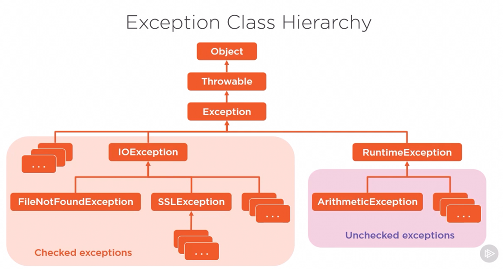
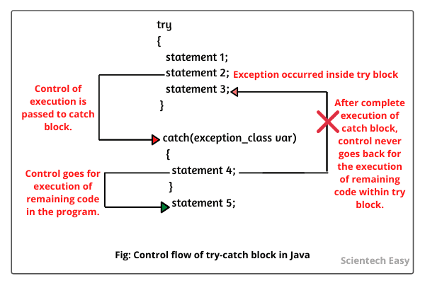

#### Checked exception example
A checked exception in Java represents a predictable, erroneous situation that can occur even if a software library is used as intended.
For example, if a developer tries to access a file that does not exist.

#### Unchecked exception example
Unchecked exceptions result from faulty logic that can occur anywhere in a software program. For example, if a
developer invokes a method on a null object, an unchecked NullPointerException occurs. If a developer attempts to
access an array element that does not exist, the unchecked ArrayIndexOutOfBoundsException occurs.

#### Errors
Serious runtime environment problems that are almost certainly not recoverable. Some examples are OutOfMemoryError, LinkageError, and StackOverflowError.

Try-catch logic

Item 69: Use exceptions only for exceptional conditions

Item 70: Use checked exceptions for recoverable conditions and runtime exceptions for programming errors

        The easiest way to eliminate checked exception is to return Optional of the desired result type. Instead of 
        throwing checked exception, the method simply returns an empty Optional. The disavantage of this technique is that 
        the method can’t return additional information detailing the inability to perform the desired computation.
        You can also turn a checked exception into an unchecked exception by breaking the method that throws the exception into two methods.

Item 71: Avoid unnecessary use of checked exceptions

         If there is not much the caller can do, a runtime exception shall be thrown.

Item 72: Favor the use of standard exceptions

        - Makes your API easier to learn and use. 
        - The client code is easier to read because programmers aren’t cluttered with unfamiliar exceptions.
        - Fewer exception classes means a smaller memory footprint and less time spent loading classes            

Item 73: Throw exceptions appropriate to the abstraction

        Higher level should always catch lower-level exceptions and in their place, throw exceptions that can be 
        explained in terms of the higher-level abstraction. This idiom is known as exception translation.            

Item 74: Document all exceptions thrown by each method

        Always declare checked exceptions individually, and document precisely the conditions under which each one is 
        thrown using the javdoc @throws tag, but do not use @throws keyword on unchecked exceptions.

Item 75: Include failure-capture information in detail messages

        To capture a failure, the detail message of an exception should contains the values of all parameters and 
        fields that contributed to the exception.

Item 76: Strive for failure atomicity

        A failed method call shall leave the object in the state it was prior to the call      

        The simplest way to do that is to design immutable objects.
        Check parameters validity before performing the operation

Item 77: Don’t ignore exceptions

        An empty catch block defeats the purpose of exceptions, which is to force you to handle exceptional 
        conditions. If you choose to ignore an exception, the catch block should contain a comment explaining 
        why it is appropriate to do so, and the variable should be named ignored.
        Printing stack traces should be almost always avoided in production code.

Other rules:
       - Either log or rethrow Java exceptions, but never do both