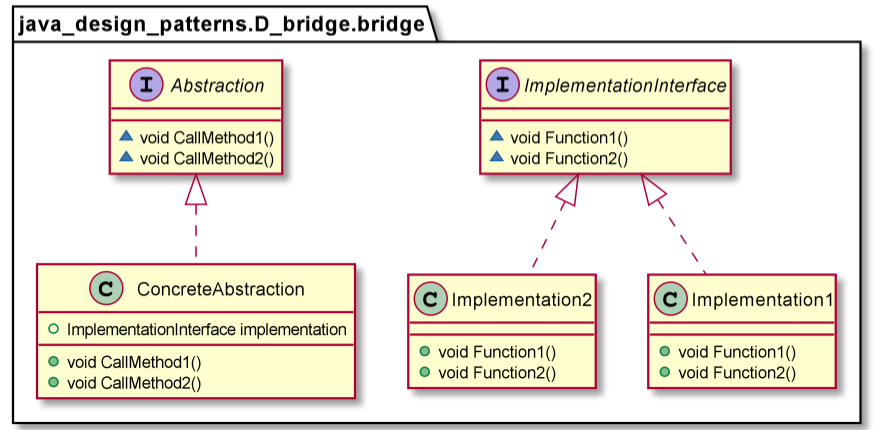
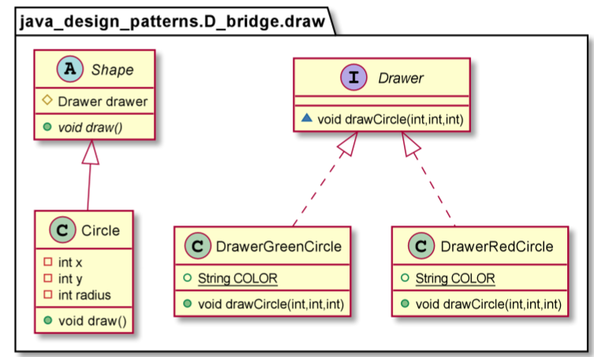
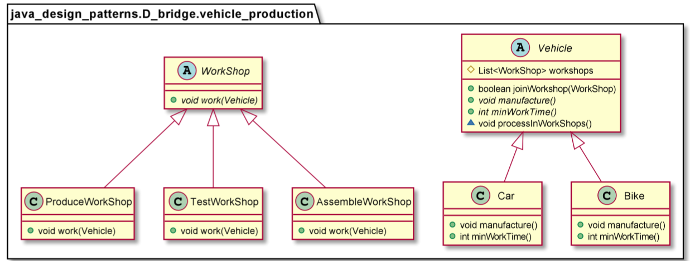

# Bridge pattern

Bridge pattern decouples an abstraction from its implementation so that the two can vary independently. The bridge pattern allows us to avoid compile-time binding between an abstraction and its implementation. This is so that an implementation can be selected at run-time.

You should use the Bridge Pattern when:
* You want to avoid a permanent binding between an abstraction and its implementation. This might be the case, for example, when the implementation must be selected or switched at run-time.
* Both the abstractions and their implementations should be extensible by sub-classing. The Bridge pattern lets you combine the different abstractions and implementations and extend them independently.
* Changes in the implementation of an abstraction should have no impact on clients; that is, their code should not have to be recompiled.

        ImplementationInterface imp1 =new Implementation1();
        ImplementationInterface imp2 =new Implementation2();

        Abstraction a1=new ConcreteAbstraction(imp1);
        a1.CallMethod1();

        Abstraction a2=new ConcreteAbstraction(imp2);
        a2.CallMethod1();

        Shape redCircle = new Circle(100,100, 10, new DrawerRedCircle());
        Shape greenCircle = new Circle(100,100, 10, new DrawerGreenCircle());
        redCircle.draw();
        greenCircle.draw();

        Vehicle bike = new Bike();
        bike.joinWorkshop(new AssembleWorkShop());
        bike.manufacture();

        Vehicle car = new Car();
        car.joinWorkshop(new ProduceWorkShop());
        car.joinWorkshop(new AssembleWorkShop());
        car.joinWorkshop(new TestWorkShop());
        car.manufacture();

