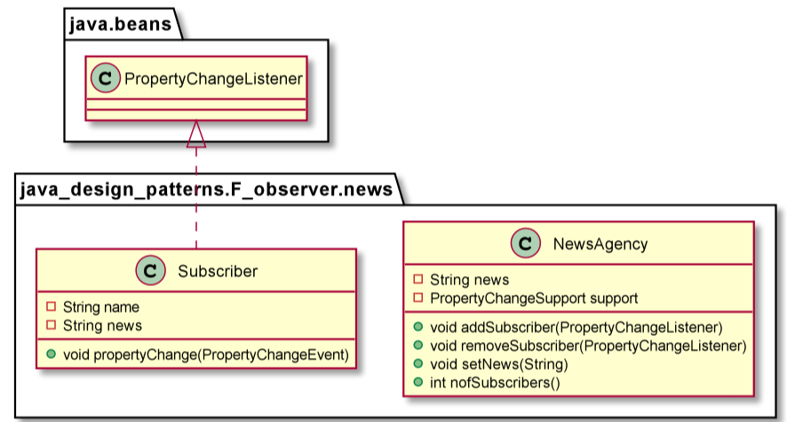

# Observer

The Observer Pattern is a kind of behavior pattern which is concerned with the assignment of responsibilities between objects. The behavior patterns characterize complex control flows that are difficult to follow at run-time. They shift your focus away from the flow of control to let you concentrate just on the way objects are interconnected.
The Observer Pattern defines a one-to-many dependency between objects so that when one object changes state, all its dependents are notified and updated automatically. The Observer pattern describes these dependencies. The key objects in this pattern are subject and observer. A subject may have any number of dependent observers. All observers are notified whenever the subject undergoes a change in its state. In response, each observer will query the subject to synchronize its state with the subject state.
The other way to understand the Observer Pattern is the way Publisher-Subscriber relationship works. Let’s assume for example that you subscribe to a magazine for your favorite sports or fashion magazine. Whenever a new issue is published, it gets delivered to you. If you unsubscribe from it when you don’t want the magazine anymore, it will not get delivered to you. But the publisher continues to work as before, since there are other people who are also subscribed to that particular magazine.

PropertyChangeListener class has replaced deprecated Observer class

Use the Observer pattern in any of the following situations:
* When an abstraction has two aspects, one dependent on the other. Encapsulating these aspects in separate objects lets you vary and reuse them independently.
* When a change to one object requires changing others, and you don’t know how many objects need to be changed.
* When an object should be able to notify other objects without making assumptions about who these objects are. In other words, you don’t want these objects tightly coupled.

        NewsPaper newsPaper = new NewsPaper();
        Subscriber subscriber1 = new Subscriber("Jonas");
        Subscriber subscriber2 = new Subscriber("Katja");

        newsPaper.addSubscriber(subscriber1);
        newsPaper.addSubscriber(subscriber2);
        newsPaper.setNews("news 1");
        newsPaper.setNews("news 2");

        Assert.assertEquals(subscriber1.getNews(), "news 2");
        Assert.assertEquals(2,newsPaper.nofSubscribers());

        newsPaper.removeSubscriber(subscriber1);
        Assert.assertEquals(1,newsPaper.nofSubscribers());