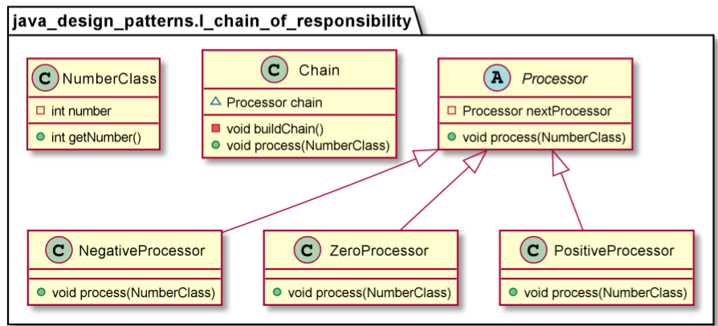

# Chain of responsibility

The intent of this pattern is to avoid coupling the sender of a request to its receiver by giving more than one object a chance to handle the request. We chain the receiving objects and pass the request along the chain until an object handles it. 

Use Chain of Responsibility when
* More than one objects may handle a request, and the handler isn’t known a priori. The handler should be ascertained automat- ically.
* You want to issue a request to one of several objects without specifying the receiver explicitly.
* The set of objects that can handle a request should be specified dynamically.

        Chain chain = new Chain();
        chain.process(new NumberWrapper(90));
        chain.process(new NumberWrapper(-50));
        chain.process(new NumberWrapper(0));
        chain.process(new NumberWrapper(91));

        =>
        PositiveProcessor : 90
        NegativeProcessor : -50
        ZeroProcessor : 0
        PositiveProcessor : 91
