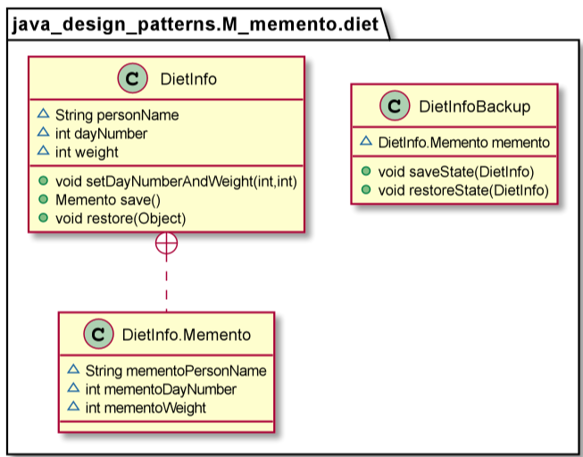

# Memento

The Memento Pattern’s intent is, without violating encapsulation, to capture and externalize an object’s internal state so that the object can be restored to this state later 

Use the Memento Pattern in the following cases:
* A snapshot of (some portion of) an object’s state must be saved so that it can be restored to that state later, and
* A direct interface to obtaining the state would expose implementation details and break the object’s encapsulation.

        DietInfoBackup backup = new DietInfoBackup();
        DietInfo dietInfo = new DietInfo("Fred", 1, 100);

        dietInfo.setDayNumberAndWeight(2, 99);
        System.out.println("Saving state.");
        backup.saveState(dietInfo);
        dietInfo.setDayNumberAndWeight(3, 98);
        dietInfo.setDayNumberAndWeight(4, 97);
        System.out.println("Restoring saved state.");
        Assert.assertEquals(4,dietInfo.getDayNumber());
        backup.restoreState(dietInfo);
        Assert.assertEquals(2,dietInfo.getDayNumber());

        =>

        DietInfo(personName=Fred, dayNumber=2, weight=99)
        Saving state.
        DietInfo(personName=Fred, dayNumber=3, weight=98)
        DietInfo(personName=Fred, dayNumber=4, weight=97)
        Restoring saved state.
        DietInfo(personName=Fred, dayNumber=2, weight=99)