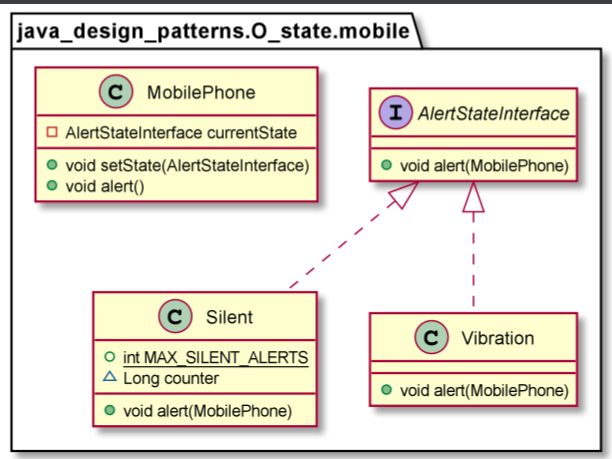

# State Design Pattern 

The State Design Pattern allows an object to alter its behavior when its internal state changes. The object will appear to change its class.
The state of an object can be defined as its exact condition at any given point of time, depending on the values of its properties or attributes. The set of methods implemented by a class constitutes the behavior of its instances. Whenever there is a change in the values of its attributes, we say that the state of an object has changed.

Use the State pattern in either of the following cases:
* An object’s behavior depends on its state, and it must change its behavior at run-time depending on that state.
* Operations have large, multipart conditional statements that depend on the object’s state. This state is usually represented by one or more enumerated constants. Often, several operations will contain this same conditional structure. The State pattern puts each branch of the conditional in a separate class. This lets you treat the object’s state as an object in its own right that can vary independently from other objects.

        MobilePhone stateContext = new MobilePhone();
        stateContext.alert();
        stateContext.setState(new Silent());
        stateContext.alert();
        stateContext.alert();
        stateContext.alert();
        stateContext.alert();

    =>

    vibration...
    silent...
    silent...
    silent...
    Nof silent alerts exceeded, switching to vibration state, counter = 3
    vibration.