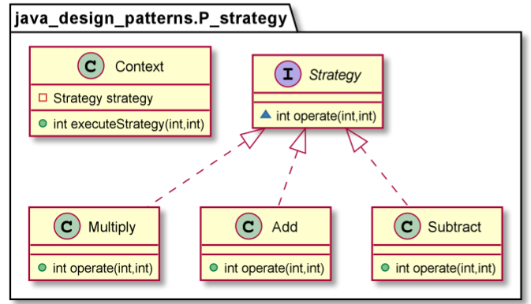

# Strategy pattern

The Strategy Design Pattern defines a family of algorithms, encapsulating each one, and making them interchangeable. Strategy lets the algorithm vary independently from the clients that use it.
The Strategy pattern is useful when there is a set of related algorithms and a client object needs to be able to dynamically pick and choose an algorithm from this set that suits its current need. The Strategy pattern suggests keeping the implementation of each of the algorithms in a separate class. Each such algorithm encapsulated in a separate class is referred to as a strategy. An object that uses a Strategy object is often referred to as a context object.

Use the Strategy pattern when:
* Many related classes differ only in their behavior. Strategies provide a way to configure a class with one of many behaviors.
* Youneeddifferentvariantsofanalgorithm.Forexample,youmightdefinealgorithmsreflectingdifferentspace/timetrade-offs. Strategies can be used when these variants are implemented as a class hierarchy of algorithms.
* An algorithm uses data that clients shouldn’t know about. Use the Strategy pattern to avoid exposing complex, algorithm- specific data structures.
* A class defines many behaviors, and these appear as multiple conditional statements in its operations. Instead of many condi- tionals, move related conditional branches into their own Strategy class.

        Context context = new Context(new Add());
        Assert.assertEquals(15, context.executeStrategy(10, 5));

        context = new Context(new Subtract());
        Assert.assertEquals(5, context.executeStrategy(10, 5));

        context = new Context(new Multiply());
        Assert.assertEquals(50, context.executeStrategy(10, 5));