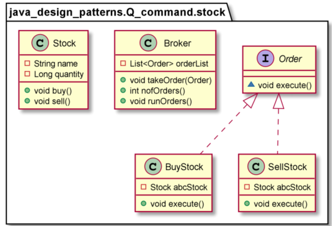
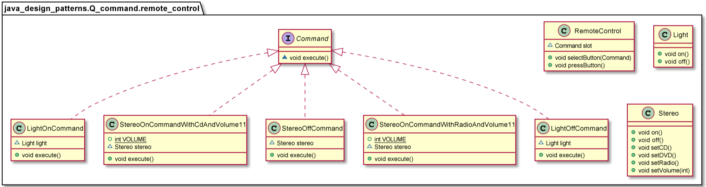

# Command pattern

In terms of implementation, the application may depend on a designated object that invokes methods on these objects by passing the required data as arguments. This designated object can be referred to as an invoker as it invokes operations on different objects. The invoker may be treated as part of the client application. The set of objects that actually contain the implementation to offer the services required for the request processing can be referred to as Receiver objects.
Using the Command pattern, the invoker that issues a request on behalf of the client and the set of service-rendering Receiver objects can be decoupled. The Command pattern suggests creating an abstraction for the processing to be carried out or the action to be taken in response to client requests. This abstraction can be designed to declare a common interface to be implemented by different concrete implementers referred to as Command objects. Each Command object represents a different type of client request and the corresponding processing.

Use the Command pattern when you want to:
* Parameterize objects by an action to perform.
* Specify, queue, and execute requests at different times. A Command object can have a lifetime independent of the original request. If the receiver of a request can be represented in an address space-independent way, then you can transfer a command object for the request to a different process and fulfill the request there.
* Support undo. The Command’s Execute operation can store state for reversing its effects in the command itself. The Command interface must have an added Un-execute operation that reverses the effects of a previous call to Execute. Executed commands are stored in a history list. Unlimited-level undo and redo is achieved by traversing this list backwards and forwards calling Un-execute and Execute, respectively.
* Support logging changes so that they can be reapplied in case of a system crash. By augmenting the Command interface with load and store operations, you can keep a persistent log of changes. Recovering from a crash involves reloading logged commands from disk and re-executing them with the Execute operation.
* Structure a system around high-level operations built on primitives operations. Such a structure is common in information systems that support transactions. A transaction encapsulates a set of changes to data. The Command pattern offers a way to model transactions. Commands have a common interface, letting you invoke all transactions the same way. The pattern also makes it easy to extend the system with new transactions.

        Stock aStock = new Stock("A",10L);
        Stock bStock = new Stock("B",5L);

        Order buyAStockOrder = new BuyStock(aStock);
        Order sellAStockOrder = new SellStock(aStock);
        Order buyBStockOrder = new BuyStock(bStock);
        Order sellBStockOrder = new SellStock(bStock);

        Broker broker = new Broker();
        broker.takeOrder(buyAStockOrder);
        broker.takeOrder(buyAStockOrder);
        broker.takeOrder(buyAStockOrder);
        broker.takeOrder(sellAStockOrder);
        broker.takeOrder(buyBStockOrder);
        broker.takeOrder(sellBStockOrder);

        Assert.assertEquals(6,broker.nofOrders());
        broker.runOrders();
        Assert.assertEquals(0,broker.nofOrders());

        RemoteControl remote = new RemoteControl();
        Light light = new Light();
        Stereo stereo = new Stereo();

        // we can change command dynamically
        remote.selectButton(new LightOnCommand(light));
        remote.pressButton();
        remote.selectButton(new StereoOnCommandWithCdAndVolume11(stereo));
        remote.pressButton();
        remote.selectButton(new StereoOffCommand(stereo));
        remote.pressButton();
        remote.selectButton(new StereoOnCommandWithRadioAndVolume11(stereo));
        remote.pressButton();

=>

        Light is on
        Stereo is on
        Stereo is set for CD input
        Stereo volume set to 11
        Stereo is off
        Stereo is on
        Stereo is set for Radio
        Stereo volume set to 11