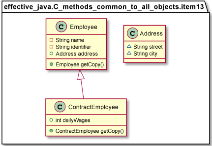

# Methods Common to All Objects

* Item 10: Obey the general contract when overriding equals

  <em>
The first advice says not to override the equals method for classes where each instance of the class is equal only to itself. 
On the contrary, it’s appropriate to override equals only on values classes.

        //check if the argument is a reference to this object
        //check if the argument has the correct typ
        //For each significant field in the class, check if that field matches the corresponding field of this object

</em>

* Item 11: Always override hashCode when you override equals
  
* Item 12: Always override toString
  
* Item 13: Override clone judiciously

<em>

    public Employee getCopy() {  return new Employee(this);  }

</em>

* Item 14: Consider implementing Comparable
  
<em>

    implements Comparable<ComparablePair>
    Comparator<Pair> byAge = (p1, p2) -> p1.getAge() - p2.getAge()
</em>

https://www.oreilly.com/library/view/effective-java/9780134686097/