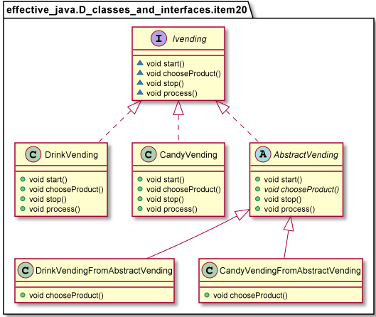

# Classes and Interfaces

* Item 15: Minimize the accessibility of classes and members
* Item 16: In public classes, use accessor methods, not public fields
* Item 17: Minimize mutability

    The class must be declared as final so that child classes can’t be created.
    Data members in the class must be declared private so that direct access is not allowed.
    Data members in the class must be declared as final so that we can’t change the value of it after object creation.
    A parameterized constructor should initialize all the fields performing a deep copy so that data members can’t be modified with an object reference.
    Deep Copy of objects should be performed in the getter methods to return a copy rather than returning the actual object reference)

* Item 18: Favor composition over inheritance
* Item 19: Design and document for inheritance or else prohibit it

    final prevents inheritance

* Item 20: Prefer interfaces to abstract classes

        avoid code duplication by defining common methods in AbstractVending, can still use interface for variable declaration

* Item 21: Design interfaces for posterity
* Item 22: Use interfaces only to define types
* Item 23: Prefer class hierarchies to tagged classes
* Item 24: Favor static member classes over nonstatic
  
  
      A static inner class does not need any outer class reference to access the member variables

* Item 25: Limit source files to a single top-level class

https://www.oreilly.com/library/view/effective-java/9780134686097/