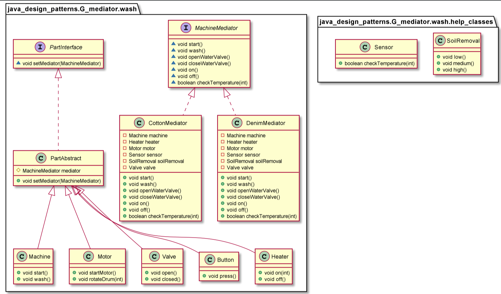

# Mediator

Rather than interacting directly with each other, objects ask the Mediator to interact on their behalf which results in reusability and loose coupling. It encapsulates the interaction between the objects and makes them independent from each other. This allows them to vary their interaction with other objects in a totally different way by implementing a different mediator. The Mediator helps to reduce the complexity of the classes. 

Used when:
* A set of objects communicate in well-defined but complex ways. The resulting interdependencies are unstructured and difficult to understand.
* Reusing an object is difficult because it refers to and communicates with many other objects.

        Sensor sensor = new Sensor();
        SoilRemoval soilRemoval = new SoilRemoval();
        Motor motor = new Motor();
        Machine machine = new Machine();
        Heater heater = new Heater();
        Valve valve = new Valve();
        Button button = new Button();

        MachineMediator mediator = new CottonMediator(machine, heater, motor, sensor, soilRemoval, valve);

        button.setMediator(mediator);
        machine.setMediator(mediator);
        heater.setMediator(mediator);
        valve.setMediator(mediator);

        button.press();