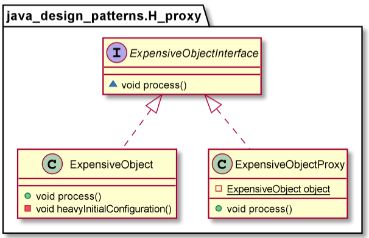

# Proxy

In the Proxy Pattern, a client does not directly talk to the original object, it delegates it calls to the proxy object which calls the methods of the original object. The important point is that the client does not know about the proxy, the proxy acts as an original object for the client. But there are many variations to this approach which we will see soon. 

* A remote proxy provides a local representative for an object in a different address space.
* A virtual proxy creates expensive objects on demand.
* A protection proxy controls access to the original object. Protection proxies are useful when objects should have different access rights.

        ExpensiveObjectInterface object = new ExpensiveObjectProxy();
        object.process();
        object.process();  //no initial configuration this time

