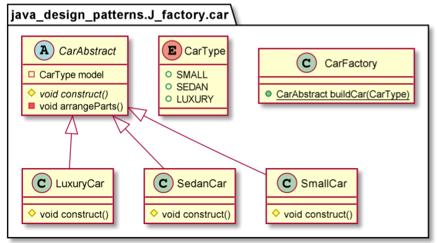

The Factory Method Pattern gives us a way to encapsulate the instantiations of concrete types. The Factory Method pattern encapsulates the functionality required to select and instantiate an appropriate class, inside a designated method referred to as a factory method. The Factory Method selects an appropriate class from a class hierarchy based on the application context and other influencing factors. It then instantiates the selected class and returns it as an instance of the parent class type.
The advantage of this approach is that the application objects can make use of the factory method to get access to the appropriate class instance. This eliminates the need for an application object to deal with the varying class selection criteria.

Use the Factory Method pattern when
* A class can’t anticipate the class of objects it must create.
* A class wants its subclasses to specify the objects it creates.
* Classes delegate responsibility to one of several helper subclasses, and you want to localize the knowledge of which helper subclass is the delegate.

        CarAbstract car=CarFactory.buildCar(CarType.SMALL);