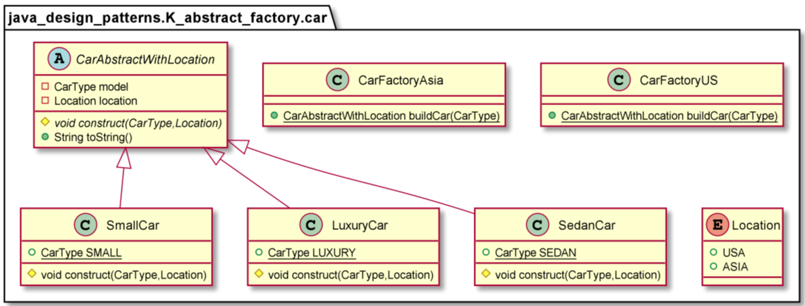
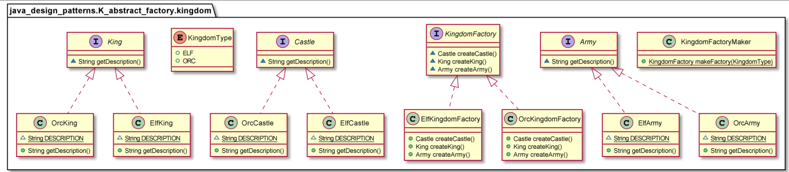

# Abstract factory

The Abstract Factory is a design pattern which provides an interface for creating families of related or dependent objects without specifying their concrete classes. The Abstract Factory pattern takes the concept of the Factory Method Pattern to the next level. An abstract factory is a class that provides an interface to produce a family of objects. In Java, it can be implemented using an interface or an abstract class.
The Abstract Factory pattern is useful when a client object wants to create an instance of one of a suite of related, dependent classes without having to know which specific concrete class is to be instantiated. Different concrete factories implement the abstract factory interface. Client objects make use of these concrete factories to create objects and, therefore, do not need to know which concrete class is actually instantiated.
The abstract factory is useful for plugging in a different group of objects to alter the behavior of the system. For each group or family, a concrete factory is implemented that manages the creation of the objects and the inter-dependencies and consistency requirements between them. Each concrete factory implements the interface of the abstract factory

Use the Abstract Factory pattern when
* A system should be independent of how its products are created, composed, and represented.
* A system should be configured with one of multiple families of products.
* A family of related product objects is designed to be used together, and you need to enforce this constraint.
* You want to provide a class library of products, and you want to reveal just their interfaces, not their implementations.

        CarAbstractWithLocation car= CarFactoryUS.buildCar(CarType.SMALL);

        KingdomFactory factory = KingdomFactoryMaker.makeFactory(KingdomType.ELF);
        King king=factory.createKing();
        Castle castle=factory.createCastle();
        Army army=factory.createArmy();