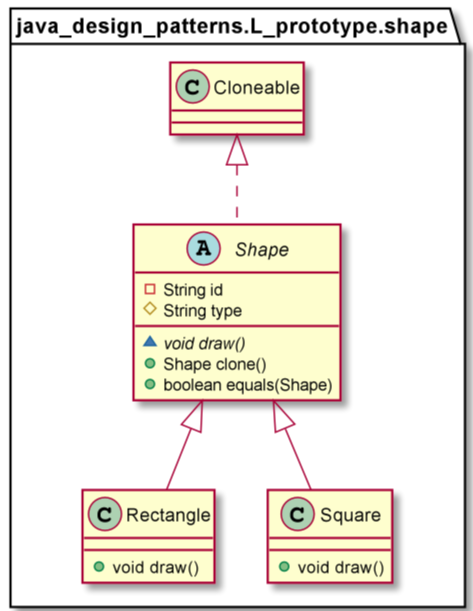
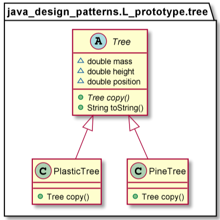

# Prototype

The Prototype design pattern is used to specify the kinds of objects to create using a prototypical instance, and create new objects by copying this prototype.
The concept is to copy an existing object rather than creating a new instance from scratch, something that may include costly operations. The existing object acts as a prototype and contains the state of the object. The newly copied object may change same properties only if required. This approach saves costly resources and time, especially when the object creation is a heavy process.
In Java, there are certain ways to copy an object in order to create a new one. One way to achieve this is using the Cloneable interface. Java provides the clone method, which an object inherits from the Object class. You need to implement the Cloneable interface and override this `clone`method according to your needs.

For example, if the class contains only primitive and immutable fields, we may use a shallow copy.
If it contains references to mutable fields, we should go for a deep copy. We might do that with copy constructors or serialization and deserialization.

Use the Prototype pattern when a system should be independent of how its products are created, composed, and represented; and
* When the classes to instantiate are specified at run-time, for example, by dynamic loading; or
* To avoid building a class hierarchy of factories that parallels the class hierarchy of products; or
* When instances of a class can have one of only a few different combinations of state. It may be more convenient to install a corresponding number of prototypes and clone them rather than instantiating the class manually, each time with the appropriate state.

        Shape square=new Square("123","Square");
        Shape squareCopy= square.clone();

        Assert.assertTrue(squareCopy instanceof Square);
        Assert.assertTrue(squareCopy.equals(square));

        Tree plasticTree = new PlasticTree(MASS, HEIGHT);
        plasticTree.setPosition(POSITION);
        PlasticTree anotherPlasticTree = (PlasticTree) plasticTree.copy();
        anotherPlasticTree.setPosition(OTHER_POSITION);

        Assert.assertEquals(POSITION, plasticTree.getPosition(),1);
        Assert.assertEquals(OTHER_POSITION, anotherPlasticTree.getPosition(),1);
