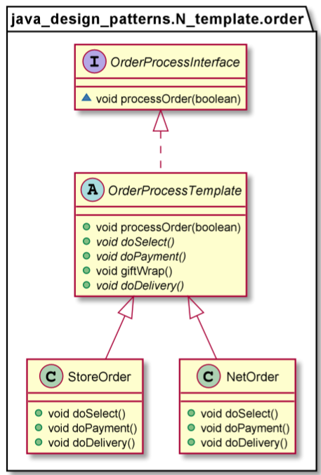

# Template pattern

The Template Pattern defines the skeleton of an algorithm in an operation, deferring some steps to subclasses. Template Method lets subclasses to redefine certain steps of an algorithm without changing the algorithm’s structure.
The Template Method pattern can be used in situations when there is an algorithm, some steps of which could be implemented in multiple different ways. In such scenarios, the Template Method pattern suggests keeping the outline of the algorithm in a separate method referred to as a template method inside a class, which may be referred to as a template class, leaving out the specific implementations of the variant portions (steps that can be implemented in multiple different ways) of the algorithm to different subclasses of this class.

The Template Method pattern should be used in the following cases:
* To implement the invariant parts of an algorithm once and leave it up to subclasses to implement the behavior that can vary.
* When common behavior among subclasses should be factored and localized in a common class to avoid code duplication. You first identify the differences in the existing code and then separate the differences into new operations. Finally, you replace the differing code with a template method that calls one of these new operations.
* To control subclasses extensions. You can define a template method that calls "hook" operations (see Consequences) at specific points, thereby permitting extensions only at those points.

    public final void processOrder(boolean isGift)
    {
        doSelect();
        doPayment();
        if (isGift) {
            giftWrap();
        }
        doDelivery();
    }

        ----------------------

        OrderProcessInterface netOrder = new NetOrder();
        netOrder.processOrder(true);
